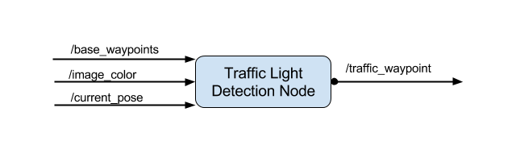

# Udacity CarND-Capstone Project

Notes to reviewer:
1. This is an independent submission. For some reasons I didn't join a team and have done the final project all by myself.
2. Name and email account:
Xian Zhang, [zhangxian37@gmail.com](zhangxian37@gmail.com)

## Project Brief Description

This project involves writing ROS nodes to implement core functionality (traffic light detection, control, etc.) of an autonomous vehicle system to realize self navigation around a track in a simulation environment and a real-life test track.

## Pipeline
The pipeline follows the typical Perception-Planning-Control paradigm of an autonomous driving system, the functional architecture of which is shown in the following diagram (in the green dashed frame).

In this project, the perception part is mainly responsible for identifying upcoming traffic lights and any obstacles in the way.
The planning part's job is to select the next N location points that are immediately in front of the vehicle out of a given fixed series of location points and assign corresponding velocity to each point for the vehicle to follow/track.
Then in the control part, those way points are interpreted as desired linear and angular speed (by Waypoint Follower node) and used as control input to generate vehicle driving-by-wire command.

The nodes marked with red frames are the focus of this project and will be detailed in the following sections.

### *Waypoint Updater Node*
The input (subscribed topic) and output (publishing topic) of this node is shown below. This node is supposed to publish a fixed number of waypoints currently ahead of the vehicle with corresponding speed information.

Some implementation details (in *waypoint_updater.py*)
- Subscribe to topic /traffic_waypoint (line 38) (other input topics have already been subscribed)
- Add other necessary member variables for this node (line 43)
- Implement callback function `pose_cb(self)`, the /final_waypoints are only published when /current_pose msg received
- Function `get_next_waypoint(self,pose)` is implemented (line 103) to get the waypoint immediately ahead of the car.
- Implement function `get_final_waypoints(self, next_waypoint)` (line 154) to prepare the /final_waypoints. A fixed number of waypoints ahead of the car are picked and each point is first assigned with the speed limit and then the speed modified if there is an upcoming red light (line 169-182)

### *DBW Node*
The input (subscribed topic) and output (publishing topic) of this node is shown below. This node is supposed to use various controllers (longitudinal and lateral) to provide appropriate throttle, brake, and steering commands.

Some implementation details:
- Subscribe to topics /current_velocity, /twist_cmd, and /vehicle/dbw_enabled (line 71-73 in *dbw_node.py*) and implemented corresponding callback functions
- Create `TwistController` object (line 66 in *dbw_node.py*) and define and supply necessary controller parameters (kp, ki, kd, ...)
-  In file *twist_controller.py*, create a `YawController` (line 13) and implemented `longitudinal_control()` (line 39). Here I used the provided yaw controller in *yaw_controller.py*

### *Traffic Light Detection Node*
The input (subscribed topic) and output (publishing topic) of this node is shown below.
The node is supposed to publish the index of the waypoint for nearest upcoming red light's stop line.

 * #### Traffic light detection
  In this module,
  - function `get_closest_waypoint(self, pose)` (line 113 in *tl_detector.py*) is implemented to get the nearest waypoint to `pose`
  - function `get_closest_vis_light(self, car_position, stop_line_positions)` (line 145 in *tl_detector.py*) is implemented to find the closest visible traffic light (if one exists). Basically, I compare the current car position with all stop line positions and if the nearest one is within some threshold distance then the corresponding traffic light is returned (detected).
 * #### Traffic light classification
  I used [Tensorflow Object Detection API](https://github.com/tensorflow/models/tree/master/research/object_detection)  to train and deploy an ssd (basenet: mobilenet) model for traffic light detection and classification.

  The steps I followed to obtain the final frozen_inference_graph.pb file are as follows:
  1. Prepare image data. I chose ~100 frames of pictures extracted from the ROS bags that were recorded at the test site, and ~260 frames of pictures recorded in the simulator.
  2. Label the image data. I used a tool called [labelImg](https://github.com/tzutalin/labelImg) to manually label all the ~370 images (annotations in xml format).
  3. Randomize and split the image data to training and validation data set and, using Tensorflow Object Detection API, generate TFRecord format file.
  4. Downlad the pretrained [ssd_mobilenet_v1_coco](http://download.tensorflow.org/models/object_detection/ssd_mobilenet_v1_coco_11_06_2017.tar.gz) model and extract the frozen graph of the model
  5. Prepare a training config file, and then using Tensorflow Object Detection API tool, train the ssd_mobilenet model
  6. After training finished, using Tensorflow Object Detection API tool again, to extract the trained model (frozen_inference_graph.pb)

  Some sample test images:
  
  
  
  
  

  It can be seen the test results (location and classification accuracy) are pretty good on both sim images and real life images, which is not too surprising since the training and the test data set are quite similar, and also since the training sample is rather small (~300), overfitting issue should be feared. To see how badly (or well) it generalize, I tried the network on some imaged downloaded from the Internet. To my surprise, there are some pretty good results as well:
  
  and some not so bad:
  
  but also some odd failure:
  
  ......

  But overall the performance of the trained ssd_mobilenet is quite acceptable and is sufficient for sim track case and should be sufficient also for the real track (if tested in Carla) seen in the bag file provided by Udacity.
  For more test images please refer to folder imgs/test_img_samples.

## Summary
